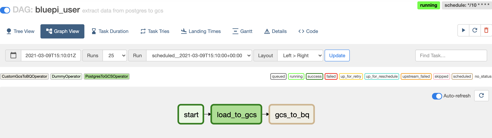

# airflow-bluepi


#DAGS config

config files located path : `dags/config/local/..`

example usage :

to create new DAG just create file.yaml in path `dags/config/local/..` with below contents

```yaml
dag_id: bluepi_user_log
default_args:
  owner: "owner"
  start_date: "2020-01-01 00:00:00"
  retries: 1
  retry_delay: "60s"
  timezone: "Asia/Bangkok"
catchup: false
schedule_interval: "*/10 * * * *"
concurrency: 1
description: "extract data from postgres to gcs"
tasks:
  - task_id: start
    operator: airflow.operators.dummy_operator.DummyOperator
  - task_id: load_to_gcs
    operator: airflow.providers.google.cloud.transfers.postgres_to_gcs.PostgresToGCSOperator
    sql: select * from user_log
    bucket: bluepi_exam
    filename: user_log.json
    postgres_conn_id: postgres_bluepi
    google_cloud_storage_conn_id: bluepi_gcs
  - task_id: gcs_to_bq
    operator: operators.custom_gcs_to_bq_operator.CustomGcsToBQOperator
    bucket: bluepi_exam
    source_objects: ['user_log.json']
    destination_project_dataset_table: BLUEPI.user_log
    source_format: NEWLINE_DELIMITED_JSON
    create_disposition: CREATE_IF_NEEDED
    write_disposition: WRITE_TRUNCATE
    bigquery_conn_id: bluepi_bq
    autodetect: False
    schema_file: /Users/parin.lou/PycharmProjects/aiflow-buildpi/schema_data/user_log.schema

flow:
  - start >> load_to_gcs >> gcs_to_bq
``` 

dag_id : dag id

default_args : default argument send into DAG

schedule_interval : crontab scheduler

concurrency : how many running task instances a DAG is allowed to have

description : DAG description

tasks : define task in this DAG

tasks_id : task_id 

operator : define which operator this task will use.

flow : define DAG pipeline  


#Pipeline 



pipeline line included 3 operator 

- `airflow.operators.dummy_operator.DummyOperator` "start" : doing nothing just telling the starting point.
- `airflow.providers.google.cloud.transfers.postgres_to_gcs.PostgresToGCSOperator` "load_to_gcs" : using PostgresToGCSOperator to extract data from postgres sql formatted into json then load into GCS
- `operators.custom_gcs_to_bq_operator.CustomGcsToBQOperator` "gcs_to_bq" : implemented of GCSToBigQueryOperator reading file from gcs then load into BQ


  


